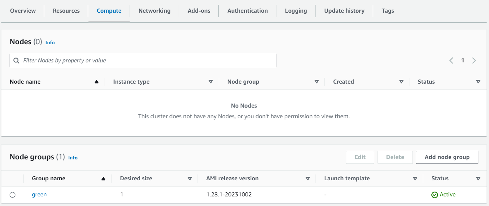
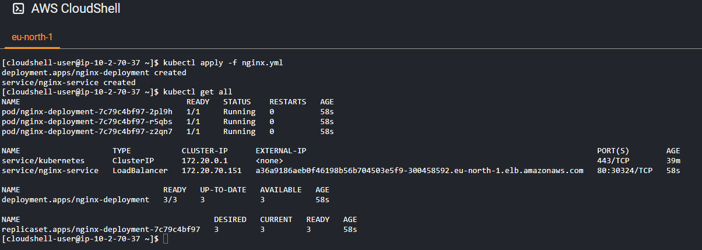
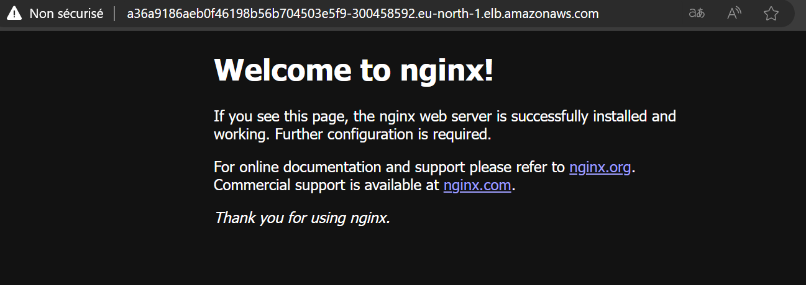

# Creating an EKS Cluster and Deploying Nginx with Terraform

Amazon Elastic Kubernetes Service (EKS) is a powerful platform for managing containerized applications. When combined with Infrastructure as Code (IaC) tools like Terraform, you can automate the setup and deployment of your EKS cluster and applications. In this article, we will guide you through the process of creating an EKS cluster using Terraform and deploying the popular web server Nginx on it.

## Prerequisites

Before we begin, you should have the following prerequisites in place:

- An AWS account with appropriate permissions.
- Terraform installed on your local machine.
- AWS CLI installed and configured with your AWS credentials.

## Step 1: Define Your Infrastructure

In this step, we will define our infrastructure using custom Terraform modules tailored to our specific requirements. These modules streamline the deployment process, making it more efficient and adaptable to your needs.

### Custom Terraform Modules

Before we proceed, let's introduce the custom Terraform modules we've created to enhance the modularity of our infrastructure definition. These modules include:

- **Network Module:** This module handles VPC, subnet configurations, and related network components, ensuring network isolation.

- **Security Group Module:** The security group module facilitates the definition and management of security groups, which are essential for controlling inbound and outbound traffic to our resources securely.

- **EKS Module:** The EKS module, the star of this article, is responsible for creating and configuring the Amazon Elastic Kubernetes Service (EKS) cluster. It orchestrates the setup of our Kubernetes environment, complete with worker nodes, control plane, and necessary components.

### Exploring the EKS Module

In this section, we will delve into the **eks module**, a critical component in managing our EKS cluster. The **eks module** is responsible for configuring and deploying the Amazon Elastic Kubernetes Service (EKS) cluster. It consists of several primary components and configurations that are pivotal for achieving a well-orchestrated Kubernetes environment:

**Creating the EKS Cluster**

To initiate our EKS cluster, we employ the `aws_eks_cluster` resource. This resource requires specific parameters to define the cluster's characteristics. Let's take a closer look at the key attributes:

- **Name:** This parameter represents the name of our EKS cluster.

- **Role ARN:** The ARN (Amazon Resource Name) of the IAM role assigned to the EKS cluster. This role is responsible for granting the necessary permissions to manage and operate the cluster. 

The `vpc_config` block, nested within the `aws_eks_cluster` resource, is also essential for specifying further details:

- **Subnet IDs:** These IDs are linked to the subnets where the cluster's resources will be deployed. 

- **Security Group IDs:** Identifying the security groups associated with the cluster for controlling network traffic.

- **Endpoint Public Access:** A crucial setting that determines whether the EKS control plane is publicly accessible.

The `depends_on` attribute ensures that this resource is created after the required IAM roles have been established.

```hcl
resource "aws_eks_cluster" "cluster" {
  name     = var.cluster_name
  role_arn = data.aws_iam_role.eks_role.arn

  vpc_config {
    subnet_ids             = var.public_subnets
    security_group_ids     = var.security_group_ids
    endpoint_public_access = var.endpoint_public_access
  }

  depends_on = [
    data.aws_iam_role.eks_role,
    data.aws_iam_role.node_role
  ]
}
```

**EKS Node Group**

The `aws_eks_node_group` resource focuses on managing the EKS node group within the cluster. It plays a pivotal role in determining the characteristics of the worker nodes in the EKS cluster. Key parameters of this resource include:

- **Cluster Name:** The name of the EKS cluster to which the node group belongs.

- **Node Group Name:** A unique identifier for the node group within the cluster.

- **Node Role ARN:** The ARN of the IAM role assigned to the node group, granting permissions for the nodes.

- **Subnet IDs:** The IDs of the subnets where the node group's instances are launched.

- **Instance Types:** The types of instances used by the node group.

- **Capacity Type:** Defining the capacity type for instances, which can be **ON_DEMAND** or **SPOT**.

The `scaling_config` block allows us to specify the desired, maximum, and minimum size of the node group. Tags can be used to provide additional metadata for resource management.

```hcl
resource "aws_eks_node_group" "node_group" {
  cluster_name    = aws_eks_cluster.cluster.name
  node_group_name = var.node_group_name
  node_role_arn   = data.aws_iam_role.node_role.arn
  subnet_ids      = var.public_subnets
  instance_types  = var.instance_types
  capacity_type   = var.capacity_type

  scaling_config {
    desired_size = var.desired_size
    max_size     = var.max_size
    min_size     = var.min_size
  }

  tags = {
    "kubernetes.io/cluster/${aws_eks_cluster.cluster.name}" = "owned"
  }

  depends_on = [
    data.aws_iam_role.eks_role,
    data.aws_iam_role.node_role
  ]
}
```

**Managing Add-ons**

We can efficiently manage Kubernetes add-ons using the `aws_eks_addon` resource. This resource enables you to specify and configure add-ons for the EKS cluster. It allows you to define add-ons, their versions, and how conflicts are resolved when creating add-ons.

```hcl
resource "aws_eks_addon" "addons" {
  for_each          = { for addon in var.addons : addon.name => addon }
  cluster_name      = aws_eks_cluster.cluster.id
  addon_name        = each.value.name
  addon_version     = each.value.version
  resolve_conflicts_on_create = "OVERWRITE"
}
```

**Role Configuration**

In the Terraform configuration, we use the `data "aws_iam_role"` data sources to access the Amazon Resource Names (ARNs) of these roles:

```hcl
data "aws_iam_role" "eks_role" {
  name = var.eks_role
}

data "aws_iam_role" "node_role" {
  name = var.node_role
}
```

**Variables Configuration**

In our **variables.tf** file, we specify and describe the variables required for configuring the EKS module. These variables cover various aspects, from cluster name and public subnets to instance types and add-ons. Properly configuring these variables ensures the EKS module adapts to your specific requirements.

```hcl
variable "cluster_name" {
  description = "A unique name for the EKS cluster."
}

variable "public_subnets" {
  description = "The IDs of the public subnets for the EKS cluster."
}

variable "security_group_ids" {
  description = "The IDs of the security groups associated with the EKS cluster."
}

variable "endpoint_public_access" {
  description = "Determines if the EKS control plane is publicly accessible."
}

variable "node_group_name" {
  description = "A unique name for the EKS node group."
}

variable "instance_types" {
  description = "The types of instances to use for the EKS node group."
}

variable "capacity_type" {
  description = "The capacity type for instances in the EKS node group."
}

variable "desired_size" {
  description = "The desired size of the EKS node group."
}

variable "max_size" {
  description = "The maximum size of the EKS node group."
}

variable "min_size" {
  description = "The minimum size of the EKS node group."
}

variable "addons" {
  type = list(object({
    name    = string
    version = string
  }))

  default = [
    {
      name    = "kube-proxy"
      version = "v1.28.1-eksbuild.1"
    },
    {
      name    = "vpc-cni"
      version = "v1.14.1-eksbuild.1"
    },
    {
      name    = "coredns"
      version = "v1.10.1-eksbuild.2"
    }
  ]
}
  variable "eks_role" {
    description = ""
  }

  variable "node_role" {
    description = ""
  }
```

## Step 2: Deploying Your Infrastructure

Now that we've defined our infrastructure using the custom Terraform modules, we're ready to deploy it. In this step, we'll execute the code that sets up our EKS cluster and related resources. Here's the code that deploys the infrastructure:

```hcl
module "network" {
  source                     = "./modules/network"
  vpc_cidr                   = "10.0.0.0/16"
  vpc_name                   = "eks-vpc"
  igw_name                   = "eks-gw"
  public_subnet_cidr_blocks  = ["10.0.1.0/24", "10.0.2.0/24", "10.0.3.0/24"]
  private_subnet_cidr_blocks = ["10.0.4.0/24", "10.0.5.0/24"]
  availability_zones         = ["eu-north-1a", "eu-north-1b"]
  public_subnet_name_prefix  = "eks-public-subnet"
  private_subnet_name_prefix = "eks-private-subnet"
  public_rt_name             = "eks-public-rt"
  private_rt_name            = "eks-private-rt"
}

module "security" {
  source                     = "./modules/securitygroup"
  security_group_name        = "eks-securitygroup"
  security_group_description = "desc"
  inbound_port               = [80, 22]
  vpc_id                     = module.network.vpc_id
}

module "eks" {
  source                 = "./modules/eks"
  cluster_name           = "eks-nginx"
  capacity_type          = "SPOT"
  public_subnets         = module.network.public_subnet_ids
  security_group_ids     = [module.security.security_group_id]
  endpoint_public_access = true
  node_group_name        = "green"
  instance_types         = ["t3.medium"]
  desired_size           = 1
  max_size               = 2
  min_size               = 1
  eks_role               = "EksClusterRole"
  node_role              = "EKS-WORKER-NODE-ROLE"
}
```
Before you proceed with the code, it is crucial to ensure that you've created the following IAM roles with their corresponding policies in your AWS console:

- **EKS-WORKER-NODE-ROLE**:
   - **Policies**:
     - AmazonEC2ContainerRegistryReadOnly
     - AmazonEKS_CNI_Policy
     - AmazonEKSWorkerNodePolicy

- **EksClusterRole**:
   - **Policies**:
     - AmazonEKSClusterPolicy

With this code, you are initiating the deployment of your infrastructure. The `module "network"` sets up your VPC, subnets, and routing, while `module "security"` configures the necessary security groups. Finally, `module "eks"` orchestrates the creation of your EKS cluster, specifying details like the cluster name, instance types, desired scaling sizes, and more.

Once you apply this Terraform configuration, the AWS resources described in your modules will be created, and your EKS cluster will begin to take shape. In the following steps, we will dive into deploying Nginx on this cluster and explore additional best practices for optimizing your setup.

```
terraform init
```
```
terraform apply -auto-approve
```




The complete source code of the project is available on [GitHub](https://github.com/kemanedonfack/eks-terraform).

## Step 3: Deploying Nginx on Your EKS Cluster

In this step, we will connect to the AWS console and use Cloud Shell to deploy Nginx on our EKS cluster. Before you begin, ensure you have the AWS CLI and kubectl configured. We will use the following Kubernetes manifest to deploy Nginx:

**nginx.yml**

```yaml
apiVersion: apps/v1
kind: Deployment
metadata:
  name: nginx-deployment
spec:
  replicas: 3
  selector:
    matchLabels:
      app: nginx
  template:
    metadata:
      labels:
        app: nginx
    spec:
      containers:
        - name: nginx
          image: nginx:latest
          ports:
            - containerPort: 80

---
apiVersion: v1
kind: Service
metadata:
  name: nginx-service
spec:
  type: LoadBalancer
  ports:
    - port: 80
      targetPort: 80
  selector:
    app: nginx
```

This manifest defines a Kubernetes Deployment and Service for Nginx. It deploys three replicas of the Nginx container and creates a LoadBalancer service to expose it externally.

Follow these steps to deploy Nginx on your EKS cluster:

1. **Access AWS Console**: Log in to the AWS Management Console.

2. **Open Cloud Shell**: In the AWS Console, locate and open AWS CloudShell. It provides you with an integrated shell environment to interact with AWS resources and your Kubernetes cluster.

3. **Configure kubectl**: If you haven't already, configure `kubectl` to use your EKS cluster by running:

   ```bash
   aws eks update-kubeconfig --region eu-north-1 --name eks-nginx
   ```


4. **Apply the Manifest**: Deploy the Nginx Deployment and Service by running:

   ```bash
   kubectl apply -f nginx.yml
   ```

   This command applies the Kubernetes manifest and deploys Nginx on your EKS cluster.

5. **Check Deployment Status**: Verify the deployment's status using the following command:

   ```bash
   kubectl get all
   ```

   You should see the `nginx-deployment` with the desired number of replicas.

   You'll see an external IP address under the `EXTERNAL-IP` column.




8. **Access Nginx**: Open a web browser and enter the external IP address. You should be able to access the Nginx welcome page.



You have now successfully deployed Nginx on your EKS cluster and made it accessible via a LoadBalancer service. 

## Conclusion

In this article, we've shown you how to create an EKS cluster and deploy Nginx using Terraform. This automation simplifies the management of your Kubernetes infrastructure and applications. With Terraform, you can easily scale and update your EKS cluster and applications as your needs evolve.

